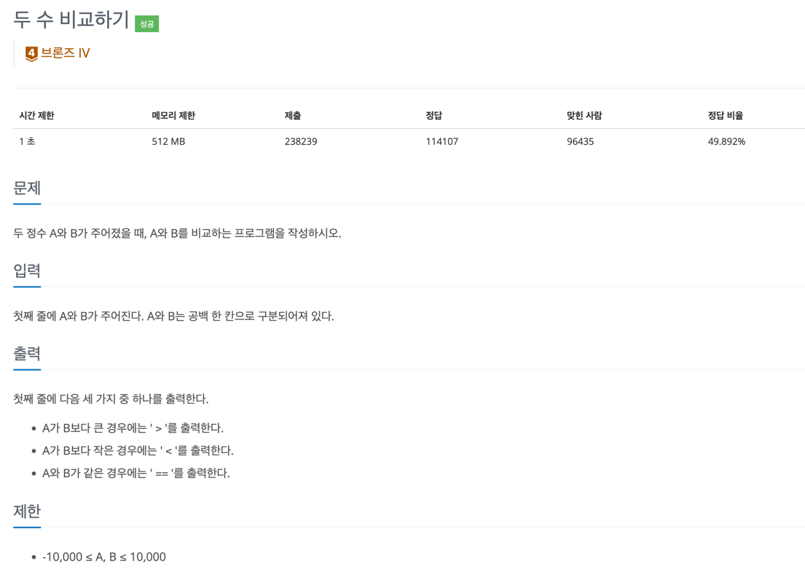
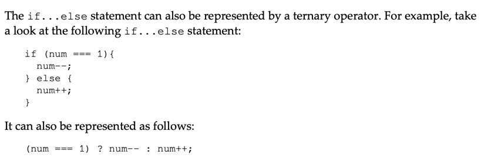

## 문제

- 백준-두 수 비교하기
- 

---

### 1. 이해

- input: 두 정 수 A와 B
- output: A와 B의 비교한 결과를 결과값에 따라서 >, <, == 로 출력한다.

### 2. 계획

- 삼항연산자로 푼다.

### 3. 실행

```javascript

const fs = require('fs');
const filePath = process.platform === 'linux' ? '/dev/stdin' : './input.txt';
let input = fs.readFileSync(filePath).toString().split('\n');

input = input[0];
input = input.split(' ').map((item) => +item);

solution(input[0], input[1]);

function solution(A, B) {
   let result;
   A > B ? result = ">" : (A === B ? result = "==" : result = "<");

   console.log(result);
}

```

### 4. 회고

- 문제는 어렵지 않은데 자바스크립트로 입력받는 게 너무 복잡한 느낌이 든다.
- == 말고 === 쓰기
- 삼항연산자는 모 아니면 도 인 경우 사용하는 게 좋다고 한다.
  - 가독성이 너무 떨어지기 때문이다.
  - 참고
    - 