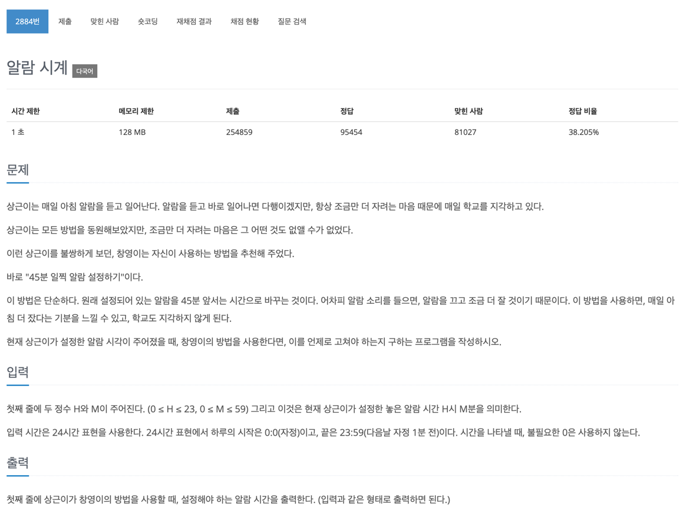

## 문제
- 백준-알람시계
- 
---

### 1. 이해
- input: 두 정수 H와 M  (0 ≤ H ≤ 23, 0 ≤ M ≤ 59)
- output: H시 M분의 45분 전 알람 시간 출력하기

### 2. 계획
> 조건을 쪼개서 생각한다.
  - 45분 이상이면?
    - H는 그대로, M-45
  - 45분 미만이면? 
    - H가 0이면?
      - H는 23, M-45+60
    - H가 0이 아니라면 
      - H-1, M-45+60

### 3. 실행
```javascript
const fs = require('fs');
const filePath = process.platform === 'linux' ? '/dev/stdin' : './input.txt';
let input = fs.readFileSync(filePath).toString().split('\n');

input = input[0];
input = input.split(' ').map((item) => +item);

solution(input[0], input[1]);

function solution(h, m) {

    if (m >= 45) {
        console.log(h, m-45)
    } else {
        if (h === 0) {
            console.log(23, (m - 45 + 60));
        } else {
            console.log(h-1, (m - 45 + 60));
        }
    }

}

```

### 4. 회고

- m(분)이 바뀌는 규칙을 찾기가 꽤 오래 걸렸다. 주어진 입출력을 잘 활용해서 다음에는 규칙을 좀 더 빠르게 찾을 수 있도록 해야겠다. 
- h === 0이라는 조건문 대신 h 그대로 넣어서 조건문에 0이 들어가면 false 가 된다는 걸 활용할 수도 있다 라는 걸 배웠다.