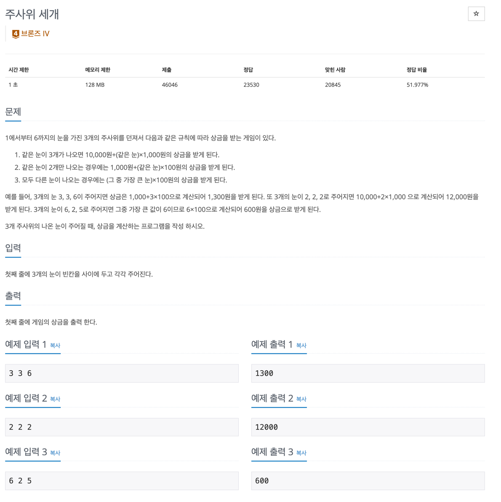

## 문제

- 백준-주사위세개
- 

---

### 1. 이해

- input: 1에서 6의 범위를 가지는 3개의 숫자
- output:  3개의 숫자 중 몇 개가 같은지에 따라서 달라지는 상금 출력

### 2. 계획

- 같은 눈 3개가 나오는 경우
    - && 연산자 이용해서 모두 같은 수인지 확인한다.
- 같은 눈 2개가 나오는 경우
    - 각각 같은지 확인하고 나머지 하나는 값이 달라야 한다.
- 모두 다른 눈이 나오는 경우
    - 동일한 값이 하나도 없어야 한다.

### 3. 실행

```javascript

const fs = require('fs');
const filePath = process.platform === 'linux' ? '/dev/stdin' : './input.txt';
let input = fs.readFileSync(filePath).toString().split('\n');

input = input[0];
input = input.split(' ').map((item) => +item);

solution(input[0], input[1], input[2]);

function solution(a, b, c) {
    if (a === b && a === c) {
        console.log(10000 + (a * 1000))
    } else if ((a === b && b != c)) {
        console.log(1000 + (a * 100))
    } else if ((a === c && a != b)) {
        console.log(1000 + (a * 100))
    } else if ((b === c) && a != c) {
        console.log(1000 + (b * 100))
    } else if (a != b && a != c && b != c) {
        let max = a;

        if (b > a) {
            if (b > c) max = b;
            else if (c > b) max = c;
        } else if (c > a) {
            if (c > b) max = c;
            else if (b > c) max = b;
        }

        console.log(max * 100);
    }
}

```

### 4. 회고

- 연산자를 이용한 단순 비교 문제이다.
- 조건문 대신 간단하게 max 메서드 이용할 수도 있다.
  ```javascript
  Math.max(a, b, c)
  ```
- 세 개의 숫자가 같지 않다면 같은 눈 2개인지 확인할 때는 2개의 값만 같다면 다른 하나는 다른지 확인할 필요는 없고 두 숫자가 같은지만 확인하면 된다. 
