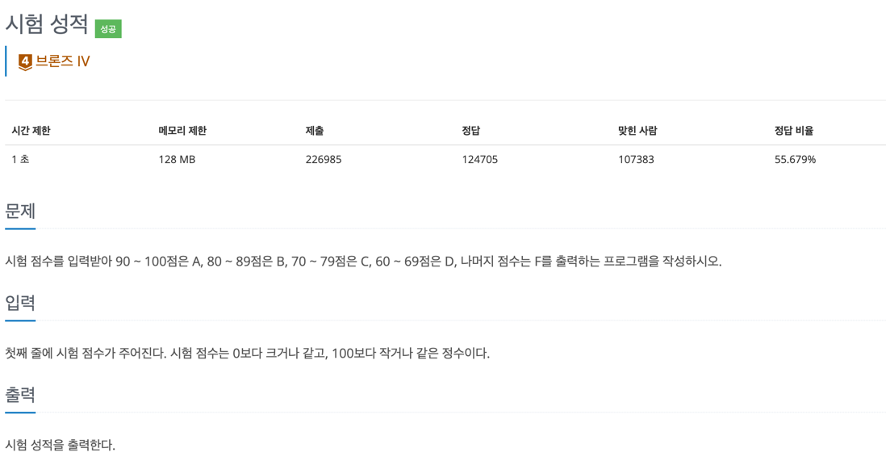
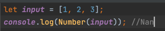

## 문제
- 백준-시험 성적
- 
---

### 1. 이해
- input: 0보다 크거나 같고, 100코다 작거나 같은 정수인 시험 점수
- output: 시험 점수의 범위에 따라 A,B,C,D,F 출력

### 2. 계획

- if,else if

### 3. 실행
```javascript
const fs = require('fs');
const filePath = process.platform === 'linux' ? '/dev/stdin' : './input.txt';
let input = fs.readFileSync(filePath).toString().split('\n');


input = Number(input[0]);

solution(input);

function solution(input) {

    if(input>=90) console.log('A')
    else if(input>=80) console.log('B')
    else if(input>=70) console.log('C')
    else if(input>=60) console.log('D')
    else console.log('F')
}
```

### 4. 회고
  > 백준 입력을 위해 복사해온 코드를 파악하지 않음. 내가 푼 문제가 맞다고 확신하고 다른 게 문제가 있는 건 아닌지 디버깅을 시도해봤어야 했는데 거기까지 나아가지 못했다. 
- 백준 입력 방식을 파악하지 못해서 시간을 많이 잡아먹었다. Number(input[0]) 과 Number(input)의 차이점이 뭘까?
  - input 이라는 변수가 배열이기 때문이다. 배열 전체를 Number 로 처리하면 Nan 오류가 뜬다.
  - input[0] 안에 "3" 같은 문자열이 있다.
  - 참고
    - 

