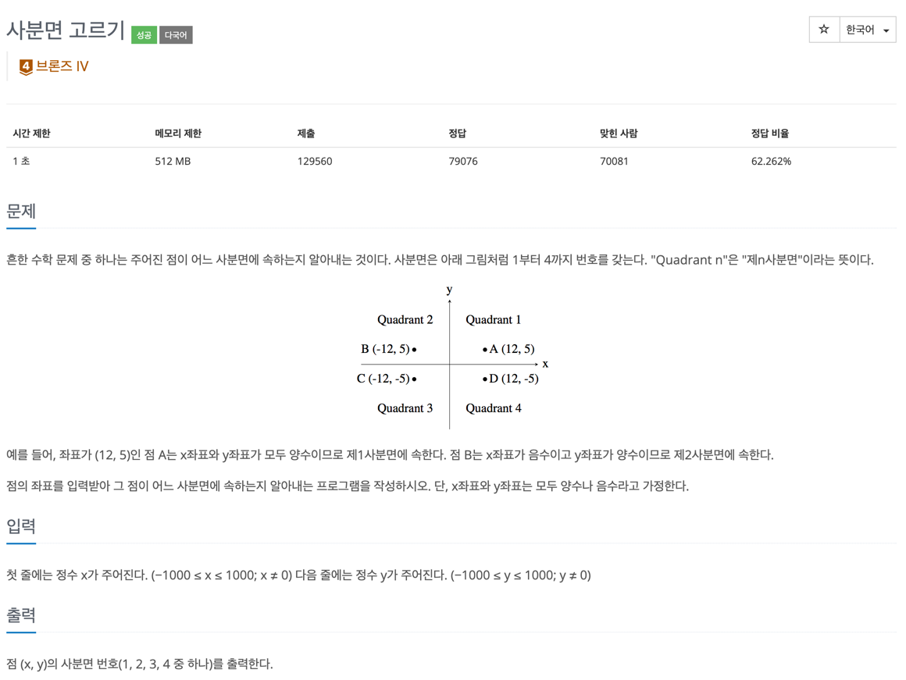

## 문제
- 백준-사분면 고르기
- 
---

### 1. 이해
- input: −1000 ≤ x ≤ 1000; x ≠ 0 (해당 범위에 있는 x, y정수 2개)
- output:  점(x, y)의 사분면 번호(1,2,3,4) 중 하나를 출력한다.

### 2. 계획
> 아래 조건에 따라 조건문 만들기
- x값이 양수이면 1 혹은 4분면
  - x값이 양수인데 y값도 양수이면 1분면
  - x값이 양수인데 y값이 음수이면 4분면
- x값이 음수이면 2 혹은 3분면
  - x값이 음수인데 y값도 음수이면 3분면
  - x값이 음수인데 y값은 양수이면 2분면 

### 3. 실행
```javascript

const fs = require('fs');
const filePath = process.platform === 'linux' ? '/dev/stdin' : './input.txt';
let input = fs.readFileSync(filePath).toString().split('\n');

input = input.map(x => +x);
solution(input)

function solution(input) {
    let x = input[0];
    let y = input[1];

    if(x>0 && y > 0) console.log(1)
    else if (x>0 && y < 0) console.log(4);
    else if (x<0 && y<0) console.log(3);
    else console.log(2);
}


```

### 4. 회고
- 문제에서 주어진 조건을 코드로 그대로 옮기면 해결된다. 


