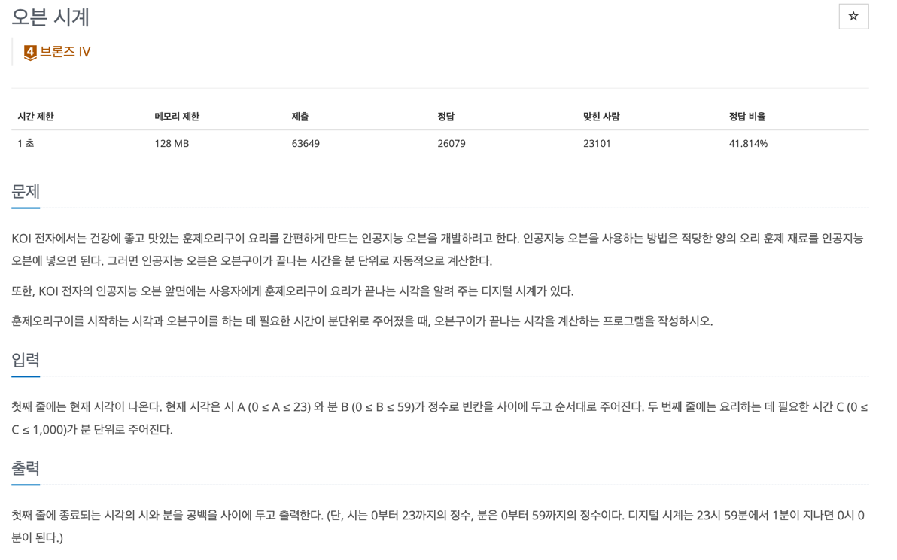

## 문제
- 백준-오븐 시계
- 
---

### 1. 이해
- input
  - 세 정수
    - 현재 시간을 나타내는 A와 B 시[A(0 ≤ A ≤ 23)], 분[B (0 ≤ B ≤ 59)]
    - 요리하는데 필요한 시간(분) [C (0 ≤ C ≤ 1,000)] 
- output: 요리가 종료되는 시간
- 참고
  - 시는 0~23
  - 분은 0~59 
  - 23시 59분에서 1분이 지나면 0시 0분이 된다.

### 2. 계획
> 조건 쪼개서 생각하고 코드로 옮기기
- 현재 시간의 분과 쿠킹시간의 분을 더해서 60이 넘지 않는 경우
  - a는 그대로, b+c
- 60이 넘는 경우 
  1. b와 c를 더한 후 60을 나눠준다.
  2. 나눈 결과의 몫은 a와 더한다.
  3. 나머지값이 c이다. 

### 3. 실행
```javascript
const fs = require('fs');
const filePath = process.platform === 'linux' ? '/dev/stdin' : './input.txt';
let input = fs.readFileSync(filePath).toString().split('\n');


let current = input[0];
const cookTime = Number(input[1]);
current = current.split(' ').map((item) => +item);

solution(current, cookTime);

function solution(current, cookingTime) {

    let h = current[0];
    let m = current[1];
    let value = m + cookingTime;

    if (value >= 60) {

        h = Math.floor(value / 60) + h;
        m = value % 60;

        if (h >= 24) {
            h -= 24;
        }

        console.log(h, m);
    } else {
        console.log(h,value);
    }
    
}
```

### 4. 회고

- 복잡해보이지만 주어진 걸 잘 쪼개서 코드로 옮기면 되는 거 같다. 
