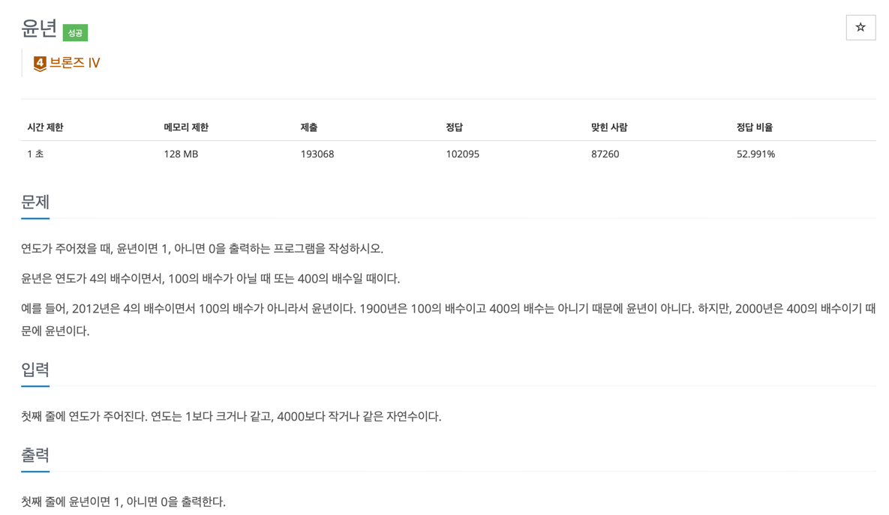

## 문제
- 백준-윤년
- 
---

### 1. 이해
- input: 연도는 1보다 크거나 같고, 4000보다 작거나 같은 자연수
- output: 윤년이면 1, 아니면 0

### 2. 계획

- 문제에 제시된 윤년의 기준으로 조건문을 만든다.

### 3. 실행
```javascript

const fs = require('fs');
const filePath = process.platform === 'linux' ? '/dev/stdin' : './input.txt';
let input = fs.readFileSync(filePath).toString().split('\n');

input = Number(input[0]);
solution(input);

function solution(input) {

    let result;

    if(input % 4 === 0 && !(input % 100 === 0)) result = 1;
    else if (input % 400 === 0) result = 1;
    else result = 0;

    console.log(result);
}

```

### 4. 회고

- 풀고나니까 or 을 이용해서 else if 문을 없앨 수도 있겠다는 생각이 든다.

